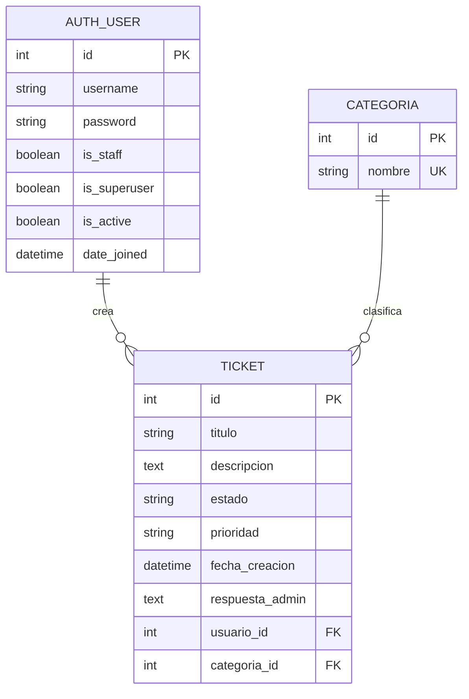

# Documento de diseño - Sistema de tickets de soporte

## 1. Presentación del aplicante

Mi nombre es Julián Ferreira, estudiante de séptimo semestre de Ingeniería de Sistemas. Mi perfil académico y profesional se enfoca principalmente en tres áreas que considero complementarias dentro del desarrollo de software moderno: datos, computación en la nube y desarrollo web.

Desde el área de datos me interesa entender cómo se estructura, valida, consulta y aprovecha la información para apoyar procesos reales. En este proyecto, ese enfoque se refleja en el diseño de modelos simples, relaciones claras entre entidades y datos de prueba coherentes para validar el flujo de uso. Desde la nube, mi interés está en construir aplicaciones que puedan evolucionar hacia ambientes más productivos, con separación de configuración por variables de entorno y una estructura que facilite despliegues futuros. Finalmente, desde el desarrollo web busco integrar backend, interfaz y experiencia de usuario para crear soluciones completas, funcionales y mantenibles.

El objetivo de esta aplicación fue implementar un sistema de tickets de soporte que permita a usuarios autenticados registrar solicitudes, consultar su estado y recibir respuesta de un administrador. A su vez, el administrador cuenta con un panel tipo Kanban para visualizar, clasificar, responder y gestionar los tickets de forma más ágil.

## 2. Decisiones de diseño y stack utilizado

La aplicación fue construida con Django 4.x porque ofrece una base sólida para aplicaciones web tradicionales: autenticación integrada, ORM, sistema de templates, panel administrativo nativo, vistas basadas en clases y protección CSRF. Esto permitió implementar el flujo completo sin agregar dependencias innecesarias ni complejidad adicional.

El stack utilizado fue:

- Python 3.11+.
- Django 4.x.
- SQLite como base de datos local para simplificar la ejecución y evitar configuración externa de PostgreSQL durante la entrega.
- Django Auth built-in para login, logout, usuarios normales y usuarios administradores.
- Django Templates para las vistas HTML.
- CSS propio para el diseño visual.
- JavaScript vanilla para interacciones puntuales.
- SortableJS mediante CDN para el drag and drop del Kanban administrativo.
- python-dotenv para leer variables de entorno desde `.env`.

Se decidió mantener una arquitectura simple con una sola app principal llamada `tickets`. La lógica de negocio se concentra en modelos, formularios y vistas de Django, evitando frameworks adicionales como DRF o JWT porque el alcance del sistema no requería una API pública ni autenticación por tokens.

También se separaron claramente los roles:

- Usuario normal: crea tickets, consulta sus propios tickets y revisa el detalle de cada solicitud.
- Usuario administrador: accede al panel Kanban, actualiza estados, responde solicitudes y elimina tickets cuando sea necesario.

Esta separación permite que cada tipo de usuario vea solo las acciones que le corresponden.

Aunque el sistema conserva el panel oficial de Django en `/admin/` para administrar modelos como respaldo técnico, se decidió construir una vista Kanban personalizada para el administrador. La razón principal es de usabilidad: el Django Admin permite revisar tickets, cambiar su estado y registrar respuestas, pero su interfaz es genérica. En cambio, el Kanban ofrece una lectura mucho más rápida del estado global de los tickets, facilita entender en qué etapa está cada caso y hace más natural la gestión operativa diaria del soporte.

## 3. Modelos y tablas creadas

El sistema utiliza los modelos propios `Categoria` y `Ticket`, además del modelo `User` incluido por Django Auth.

### Categoria

Representa el tipo general de solicitud. Tiene un campo principal:

- `nombre`: nombre único de la categoría.

Se usa una tabla independiente para evitar repetir texto en cada ticket y para permitir que las categorías puedan administrarse desde Django Admin.

### Ticket

Representa una solicitud de soporte creada por un usuario. Sus campos principales son:

- `titulo`: resumen corto del problema.
- `descripcion`: explicación del caso reportado.
- `estado`: estado actual del ticket. Puede ser `abierto`, `en_espera`, `aprobado` o `rechazado`.
- `prioridad`: nivel de urgencia. Puede ser `baja`, `media`, `alta` o `critica`.
- `fecha_creacion`: fecha automática de creación.
- `respuesta_admin`: respuesta opcional escrita por el administrador.
- `usuario`: usuario que creó el ticket.
- `categoria`: categoría asignada al ticket.

La relación entre las tablas es:

- Un usuario puede tener muchos tickets.
- Una categoría puede estar asociada a muchos tickets.
- Cada ticket pertenece a un solo usuario y a una sola categoría.

## 4. Flujo general de la aplicación

El flujo principal para usuarios normales es:

1. El usuario inicia sesión.
2. El sistema lo redirige a `Mis tickets`.
3. Desde allí puede crear un nuevo ticket.
4. El formulario valida título, descripción, categoría y prioridad.
5. El ticket se crea automáticamente con estado `abierto`.
6. El usuario puede ver su lista de tickets, filtrarlos por estado y consultar el detalle.

El flujo del administrador es:

1. El administrador inicia sesión.
2. El sistema detecta `is_staff=True` y lo redirige al panel Kanban.
3. El Kanban muestra los tickets agrupados por estado.
4. El administrador puede abrir el detalle desde el ícono de edición de cada card.
5. Puede cambiar el estado, responder al usuario o eliminar un ticket.
6. También puede arrastrar tickets entre columnas y confirmar el cambio de estado.
7. Si lo necesita, también puede usar el panel `/admin/` de Django como alternativa administrativa de respaldo.

## 5. Asunciones realizadas durante el desarrollo

Durante la construcción del proyecto se realizaron las siguientes asunciones:

- El sistema está pensado como una aplicación académica/local, por eso se usa SQLite para facilitar la ejecución sin depender de un servidor de base de datos.
- Django Auth es suficiente para manejar usuarios, sesiones y permisos, sin necesidad de JWT ni API externa.
- Los usuarios normales solo deben ver y consultar sus propios tickets.
- Los administradores son usuarios con `is_staff=True`.
- El estado del ticket no puede ser modificado por el usuario normal; solo lo modifica el administrador o el panel admin nativo.
- La prioridad puede ser seleccionada por el usuario al crear el ticket, porque representa la urgencia percibida por quien reporta el problema.
- Las respuestas del administrador son texto libre, pero limitadas a 150 caracteres para mantener mensajes concisos.
- El título del ticket está limitado a 50 caracteres y la descripción a 120 para evitar entradas demasiado extensas en la interfaz.
- El diseño visual fue mantenido simple y funcional, priorizando navegación clara, separación por roles y consistencia entre vistas.
- El comando `seed` debe ser idempotente para que pueda ejecutarse varias veces sin duplicar usuarios, categorías ni tickets base.

## 6. Uso de herramientas de inteligencia artificial

Sí se usó inteligencia artificial durante el desarrollo. La herramienta utilizada fue Claude Code.

El uso de IA se concentró principalmente en apoyo técnico y depuración, no en reemplazar el criterio de diseño del sistema. En concreto, se usó para:

- Ayudar a identificar y corregir errores durante la ejecución de migraciones, configuración y flujo de vistas.
- Depurar problemas visuales y de comportamiento en templates.
- Apoyar la implementación del drag and drop en la vista administrativa usando SortableJS.
- Ajustar la interacción del Kanban, incluyendo confirmaciones, actualización por AJAX, CSRF token y movimiento visual de cards.
- Revisar inconsistencias entre frontend y backend, especialmente en validaciones y límites de caracteres.

Las decisiones principales de arquitectura, entidades, roles, categorías y flujo funcional se mantuvieron alineadas con los requisitos del proyecto y fueron validadas durante la implementación.

## 7. Categorías propuestas para los tickets

Las categorías propuestas fueron:

### Soporte técnico

Agrupa problemas relacionados con funcionamiento general del sistema, rendimiento, errores de carga o inconvenientes técnicos que afectan el uso normal de la aplicación. Esta categoría permite separar incidentes operativos de consultas administrativas o comerciales.

### Facturación

Se utiliza para casos relacionados con cobros, facturas, pagos, valores incorrectos o dudas sobre movimientos económicos. Es una categoría necesaria porque estos tickets suelen requerir revisión puntual y tienen impacto directo para el usuario.

### Cuenta y acceso

Incluye problemas de inicio de sesión, cambios de correo, recuperación de acceso, validación de identidad o inconvenientes asociados a la cuenta del usuario. Se definió porque los problemas de acceso suelen bloquear completamente el uso del sistema.

### Consulta general

Permite registrar solicitudes informativas que no necesariamente son errores ni problemas técnicos. Por ejemplo, dudas sobre planes, condiciones de servicio, uso de funcionalidades o información general.

### Reporte de error

Está destinada a errores específicos de la aplicación, como botones que fallan, mensajes inesperados o funcionalidades que no responden correctamente. Esta categoría ayuda a identificar posibles bugs y priorizar su revisión.

Estas categorías buscan cubrir los casos más comunes en un sistema de soporte sin hacer la clasificación demasiado compleja. El criterio utilizado fue separar los tickets por naturaleza del problema: técnico, económico, acceso, consulta informativa o error funcional.

## 8. Conclusión

El proyecto implementa un sistema de tickets funcional con Django, manteniendo una estructura clara, roles diferenciados y una base de datos sencilla. La solución permite cubrir el flujo completo de soporte: creación del ticket por parte del usuario, seguimiento de estado, respuesta administrativa y gestión visual desde un Kanban.

La implementación prioriza simplicidad, mantenibilidad y facilidad de ejecución. Aunque el sistema está preparado como entrega académica local, su estructura permite evolucionar posteriormente hacia un entorno más robusto, por ejemplo usando PostgreSQL, agregando pruebas automatizadas, mejorando permisos o ampliando reportes administrativos.
